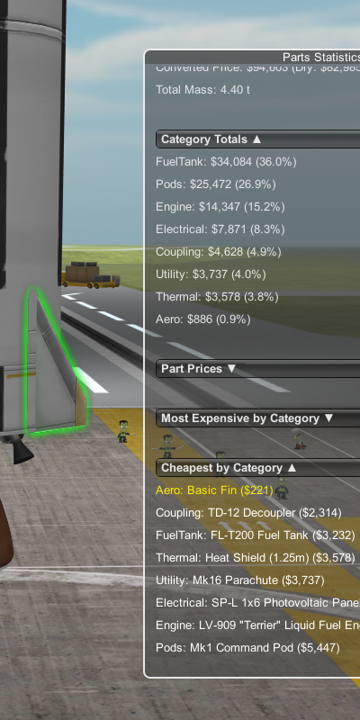

# Kerbal Currency Display  

## English  

Have you ever wondered how much your in-game funds (√) would be worth in real money?  
Here’s the solution: **Kerbal Currency Display** converts Kerbal Funds (√) into **USD** and other major currencies.  
With category-based weighting, it’s designed to reflect real-world value as closely as possible.  

### Features  
- Converts in-game funds (√) to USD with **category-based weighting** for realistic pricing.  
- Supports multiple currencies: **USD, KRW, JPY, EUR**.  
- Provides a **detailed part-by-part price list**.  
- **Statistics window** with expandable/collapsible sections:  
  - Total part count  
  - Spending by category (with percentage of total)  
  - Most and least expensive parts (overall and per category, with clickable entries to highlight the parts in the editor)
- **Language** selection:
  - Switch between supported languages (English / Korean) instantly in settings.

### License  
Distributed under the **Creative Commons Attribution-NonCommercial-NoDerivatives 4.0 International** license.  
[Learn more](https://creativecommons.org/licenses/by-nc-nd/4.0/).  

---

## 한국어  

게임 내에서 사용하는 자금(√)이 실제 화폐가치로 얼마나 될지 궁금해 하셨던 경험이 있나요?  
**Kerbal Currency Display**가 그 답을 드리겠습니다. 이 모드는 인게임 자금(√)을 **USD**를 비롯한 주요 통화로 변환해 주며,  
카테고리별로 가중치를 적용해 실제 화폐 가치에 최대한 가깝게 설계되었습니다.  

### 주요 기능  
- **카테고리별 가중치**를 적용해 현실적인 USD 환산 가격 계산  
- 지원 통화: **USD, KRW, JPY, EUR**  
- **부품별 가격 리스트** 제공  
- **통계 창** 기능 (카테고리별 확장/축소 가능):  
  - 전체 부품 개수  
  - 카테고리별 지출액 및 전체 대비 비율  
  - 전체/카테고리별 가장 비싼/저렴한 부품 (클릭 시 부품 강조 표시)
- **언어 설정** 기능
  - 설정 메뉴에서 즉시 영어/한국어 전환 가능

### 라이선스  
이 모드는 **CC BY-NC-ND 4.0 국제 라이선스**로 배포됩니다.  
[자세히 보기](https://creativecommons.org/licenses/by-nc-nd/4.0/deed.ko)  

---

## Screenshots

